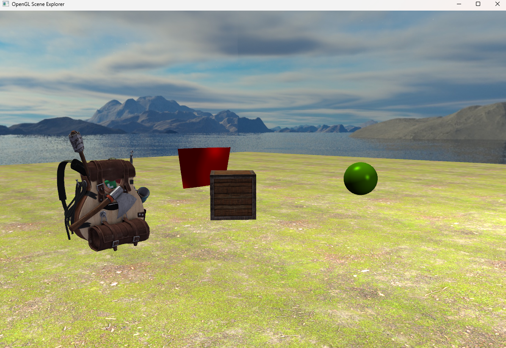
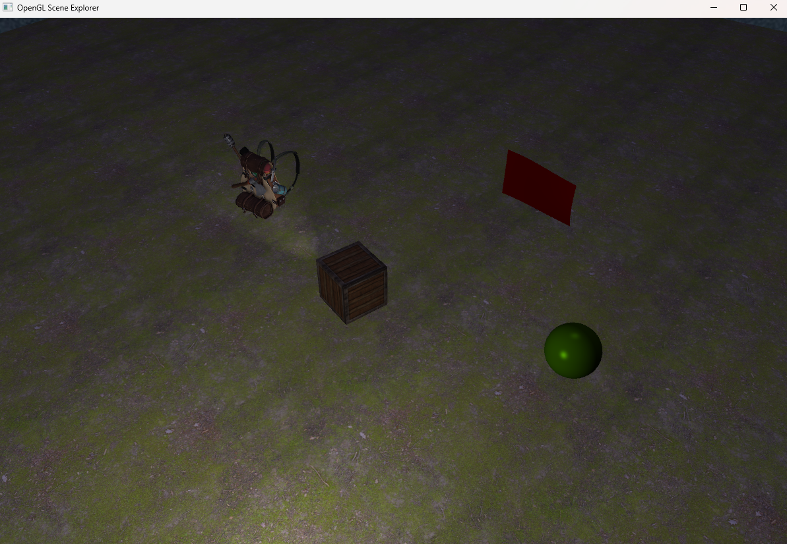
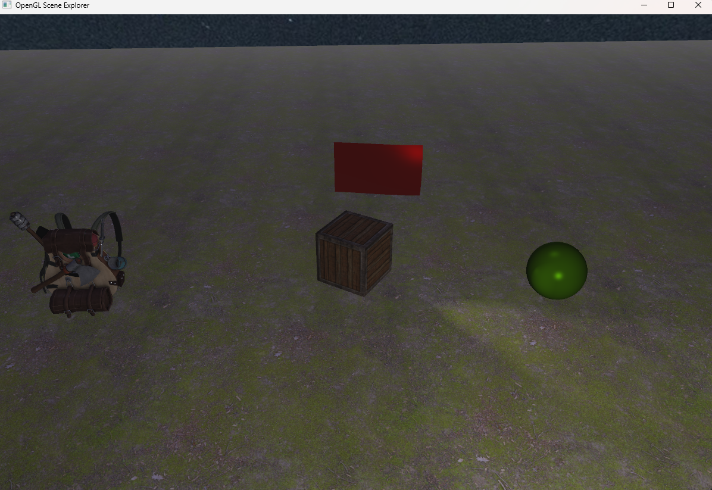

# 🌍 OpenGL Scene Explorer

This project is the **fourth assignment** in a series of graphics applications developed for the **Computer Graphics** course. Unlike the previous **WPF projects**, this one is built with **C++ / OpenGL**, inspired by [learnopengl.com](https://learnopengl.com/). It demonstrates real-time rendering techniques, lighting, animation, and interactive scene control.

## 🎓 Academic Context

Project created as part of the academic course **Computer Graphics** during the **2024/2025 winter semester** at **Warsaw University of Technology**.

## ✨ Features

* 🔦 **Lighting models**
  * Real-time shading using the **Blinn–Phong reflection model** 

* 🌫️ **Fog**
  * Toggle environmental fog on/off.

* 🎮 **Objects**
  * 🟢 **Sphere** – supports Phong-Blinn lighting with adjustable `shininess (m)` and `specular (ks)`.
  * 🎌 **Flag** – animated in the wind, with adjustable **frequency** and **speed**.
  * 📦 **Moving box with spotlight** – spotlight follows the box, and its direction can be interactively controlled.
  * 🎒 **Backpack model** – complex 3D object imported with **Assimp**.

* 📷 **Cameras**
  1. 🕹️ **Free camera** – move with **WASD** + mouse.
  2. 📌 **Static camera** – fixed viewpoint.
  3. 🎥 **Target camera** – fixed in one place, tracking the moving spotlight box.

* ⚙️ **Object editing mode**
  * Switch between editable objects with **M**.
  * Modify their properties interactively using **arrow keys**.

## 🎮 Controls

* **Movement (in free camera mode)**: `WASD` + Mouse
* **Change camera**: `C`
* **Toggle fog**: `F`
* **Toggle day/night**: `P`
* **Edit mode**: `M` (cycle through objects: sphere → flag → spotlight direction → wind → back to sphere)
* **Adjust properties**: Arrow keys depending on selected object:

  * 🔵 **Sphere / Flag**:
    * ⬆️ Increase `m` (shininess)
    * ⬇️ Decrease `m`
    * ➡️ Increase `ks` (specular)
    * ⬅️ Decrease `ks`
  * 🔦 **Spotlight**:
    * ⬆️ / ⬇️ Tilt up/down
    * ➡️ / ⬅️ Pan right/left
  * 🌬️ **Wind**:
    * ⬆️ Increase frequency
    * ⬇️ Decrease frequency
    * ➡️ Increase speed
    * ⬅️ Decrease speed

## 🛠️ Technologies

* **C++ / OpenGL**
* **GLFW / GLAD** for context and extensions
* **Assimp** for model loading (backpack)
* Custom **Phong / Blinn–Phong shaders**
* **Real-time animation** (flag in the wind, moving spotlight box)

## 🖼️ Preview

## 👤 Author

Developed by [Piotr Iśtok](https://github.com/p10tr13).

## 📜 License

This project is released under the MIT License.
